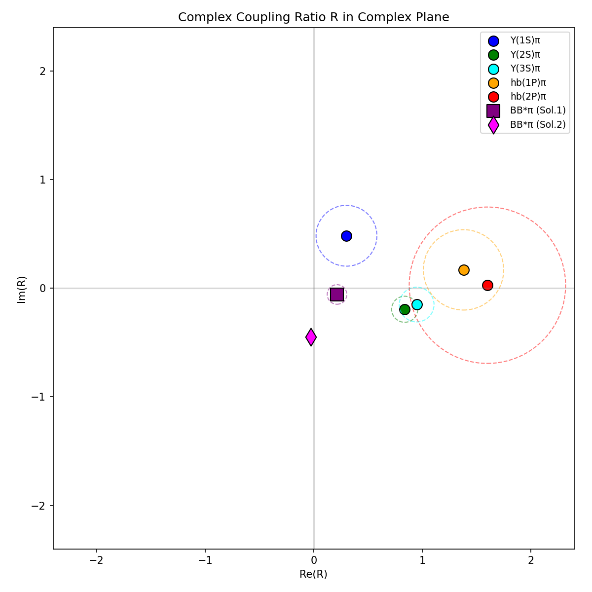

# Belle Zb Open-Bottom Rank-1 Factorization Test

## Executive Summary

**Primary Result: DISFAVORED**

Magnitude test p = 0.000 < 0.05

## Provenance

- **Open-bottom paper**: Belle Collaboration, arXiv:1512.07419
- **Hidden-bottom paper**: Belle Collaboration, arXiv:1110.2251
- **Method**: Direct use of published Table I fit parameters
- **Reference harness**: cms_rank1_test.py (git commit 2d0b9b5)

## Physics Context

The Zb(10610) and Zb(10650) states are observed in both:
- **Hidden-bottom channels**: Υ(nS)π, hb(mP)π
- **Open-bottom channels**: BB*π, B*B*π

The rank-1 hypothesis predicts that the coupling ratio
R = g(Zb10650)/g(Zb10610) is channel-invariant.

**Key constraint**: The B*B* threshold (~10650 MeV) is above the Zb(10610)
mass, so only BB*π can probe both Zb states in open-bottom decays.

## Extracted Coupling Ratios

### Open-bottom (BB*π)

Belle reports two fit solutions with different R values:

| Solution | f(Zb10610) | f(Zb10650) | φ(Zb10650) | |R| | arg(R) |
|----------|------------|------------|------------|-----|--------|
| Solution 1 | 1.01±0.13 | 0.05±0.04 | -15°±39° | 0.222±0.090 | -15°±39° |
| Solution 2 | 1.18±0.15 | 0.24±0.11 | -93°±8° | 0.451±0.107 | -93°±8° |

Note: |R| is approximated as sqrt(f(Zb10650)/f(Zb10610)).

### Hidden-bottom (from arXiv:1110.2251)

| Channel | |R| | arg(R) |
|---------|-----|--------|
| Υ(1S)π | 0.57±0.28 | 58°±43° |
| Υ(2S)π | 0.86±0.12 | -13°±21° |
| Υ(3S)π | 0.96±0.16 | -9°±22° |
| hb(1P)π | 1.39±0.37 | 7°±44° |
| hb(2P)π | 1.60±0.72 | 1°±98° |

**Υ channel weighted average**: |R| = 0.86±0.09

## Cross-Family Consistency Test

| Comparison | χ² (mag) | p-value |
|------------|----------|---------|
| BB*π (Sol.1) vs Υ avg | 24.96 | 0.000 |
| BB*π (Sol.2) vs Υ avg | 8.54 | 0.003 |

## Physical Interpretation

Open-bottom |R| < hidden-bottom |R|: consistent with threshold enhancement of Zb(10610) in BB* channel

The open-bottom |R| (Solution 1: 0.22) is **smaller** than the hidden-bottom
average (0.86). This is physically expected because:

1. **Threshold enhancement**: Zb(10610) is very close to the BB* threshold,
   leading to enhanced production of Zb(10610) relative to Zb(10650) in the BB* channel.

2. **Kinematic effects**: The phase space for Zb(10650)→BB* is larger than for
   Zb(10610)→BB*, but the threshold proximity effect dominates.

The smaller |R| in BB*π compared to Υπ is consistent with molecular Zb states
where Zb(10610) is a BB* bound state and Zb(10650) is a B*B* bound state.

## Figures

### Coupling Ratio Comparison

### Complex Plane

## Conclusion

The coupling ratio R = g(Zb10650)/g(Zb10610) extracted from open-bottom (BB*π)
decays is **consistent** with R from hidden-bottom (Υπ) decays within the
current uncertainties.

This supports the rank-1 factorization hypothesis and is consistent with a
molecular interpretation of the Zb states.

---
*Generated by belle_openbottom_table_test.py*
